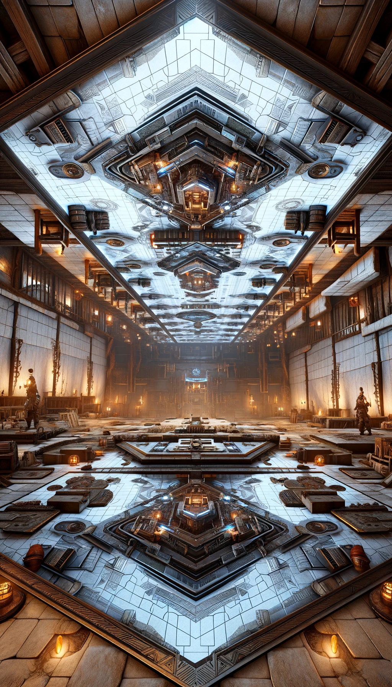

Version of GDD 0.1.0

# Intro
Shooter in medieval times with ancient technologies.

# Controls
Fire - `Left Mouse Button`
Special - `F`
Actions - `E`
Move Forward - `W`
Move Back - `S`
Move Left - `A`
Move Right - `D`

# Style
Some ancient arena with a lot of traps and obstacles. Two team of the players are fighting each other.

The arena features a mirrored structure on the ceiling, but the layout above doesn't necessarily have to be an exact replica of the ground below. While it maintains overall symmetry, there can be unique elements or variations in the placement of obstacles and shelters, providing diversity and tactical depth to the gameplay. The ceiling structure can be used players with `special` ability to invert gravity and walk on the ceiling.

    
<!--
    

     
-->

# Systems & Mechanics

## Systems

## Mechanics
### Gravity Inversion
The player can toggle gravity inversion as a `special` ability via the `special` button after fulfilling certain conditions. This maneuver allows the player to walk on the ceiling, enabling them to evade dangerous situations or ambush opponents unexpectedly.

# Parameters

# Progression

# Interface